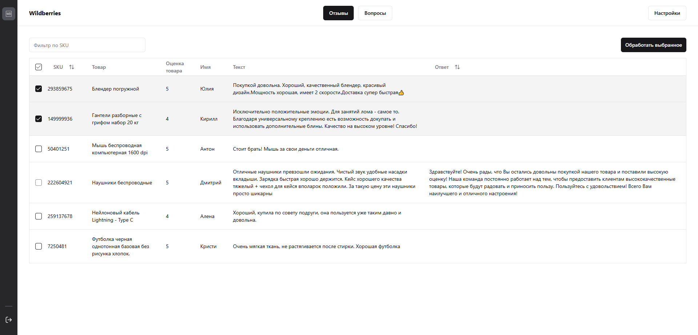

# Marketplace Helper

Проект по автоматизации ответов на отзывы Wildberries с помощью ИИ.



## Dev стак

**WEB:** React.js, TypeScript, MobX, Axios, Tailwind CSS, shadcn/ui

**API:** FastAPI, SQLModel, PostgreSQL, Alembic, asyncio/aiohttp

## Запуск проекта

Запустить весь проект можно на любом сервере с помощью Docker Compose, либо локально каждый отдельно

1. **Клонирование репозитория:**

```bash
git clone https://github.com/Ibarakilol/marketplace-helper.git
cd marketplace-helper
```

2. **Настройка переменных среды:**

**WEB:** Переименовать файл `.env.example` на `.env` в папке `marketplace-helper-web` и удалить `VITE_APP_JWT_TOKEN`, если установка происходит через Docker Compose, либо вместе с API

**API:** Переименовать файл `.env.example` на `.env` в папке `marketplace-helper-api`, изменить значения переменных `changethis` и поменять `POSTGRES_SERVER` на `db`, если установка происходит через Docker Compose

3. **Установка зависимостей и запуск:**

_Через Docker Compose_

```bash
docker compose build
docker compose up
```

_Для тех, кто хочет локально потестировать каждый проект (Web/API) отдельно_

```bash
chmod a+x ./scripts/web.sh && ./scripts/web.sh
chmod a+x ./scripts/api.sh && ./scripts/api.sh
```
